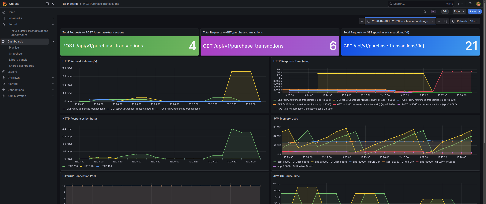

# WEX Purchase Transactions API

A Spring Boot REST API that stores purchase transactions in US dollars and retrieves them with currency conversion using the [Treasury Reporting Rates of Exchange API](https://fiscaldata.treasury.gov/datasets/treasury-reporting-rates-exchange/treasury-reporting-rates-of-exchange).

## Prerequisites

- **Java 25** (required)
- Maven Wrapper included — no Maven installation needed
- **Docker & Docker Compose** (for the containerized deployment)

## Running Locally

The default configuration uses H2 (file-based) and Caffeine cache — no external services required.

```bash
./mvnw spring-boot:run
```

The API starts on `http://localhost:8080`.

| Resource | URL |
|----------|-----|
| Swagger UI | http://localhost:8080/swagger-ui.html |
| OpenAPI Spec | http://localhost:8080/v3/api-docs |
| Health Check | http://localhost:8080/actuator/health |

## Running with Docker Compose

The Docker stack runs 2 app replicas behind an NGINX load balancer, with PostgreSQL, Redis, Prometheus, and Grafana.

### 1. Create the `.env` file

The compose file reads environment variables from a `.env` file (not committed to Git). Create it from the example:

```bash
cp .env.example .env
```

Edit `.env` to adjust database credentials, cache settings, or any other values as needed. See `.env.example` for all available variables.

### 2. Start the stack

```bash
docker compose up --build
```

### 3. Access the services

| Service | URL | Credentials |
|---------|-----|-------------|
| API | http://localhost:8080/api/v1/purchase-transactions | — |
| Swagger UI | http://localhost:8080/swagger-ui/index.html | — |
| Grafana Dashboard | http://localhost:3000/d/wex-app-dashboard/wex-purchase-transactions?orgId=1&from=now-30m&to=now&timezone=browser&refresh=10s | `admin` / `admin` |

### Grafana Dashboard



### 4. Stop the stack

```bash
docker compose down
```

## API Endpoints

The application exposes three REST endpoints under `/api/v1/purchase-transactions`:

| Method | Path | Description |
|--------|------|-------------|
| `POST` | `/api/v1/purchase-transactions` | Store a new purchase transaction |
| `GET` | `/api/v1/purchase-transactions` | List transactions with optional filters and pagination |
| `GET` | `/api/v1/purchase-transactions/{id}?currency=` | Retrieve a transaction converted to the target currency |

### POST — Request Body

| Field | Type | Constraints |
|-------|------|-------------|
| `description` | `string` | Required, max 50 characters |
| `transactionDate` | `date` | Required, ISO format (`yyyy-MM-dd`) |
| `purchaseAmount` | `decimal` | Required, positive, rounded to nearest cent on store |

### POST — Response (201 Created)

| Field | Type | Description |
|-------|------|-------------|
| `id` | `string` | TSID unique identifier |
| `description` | `string` | Transaction description |
| `transactionDate` | `date` | Transaction date |
| `purchaseAmount` | `decimal` | Amount in USD (rounded to 2 decimal places) |

### GET — Parameters

| Parameter | In | Type | Description |
|-----------|----|------|-------------|
| `id` | path | `long` | Transaction identifier |
| `currency` | query | `string` | Target currency in Treasury API format (e.g., `Canada-Dollar`, `Brazil-Real`, `Euro Zone-Euro`) |

### GET — Response (200 OK)

| Field | Type | Description |
|-------|------|-------------|
| `id` | `string` | TSID unique identifier |
| `description` | `string` | Transaction description |
| `transactionDate` | `date` | Transaction date |
| `purchaseAmount` | `decimal` | Original amount in USD |
| `exchangeRate` | `decimal` | Exchange rate used (most recent within 6 months of transaction date) |
| `convertedAmount` | `decimal` | Converted amount rounded to 2 decimal places |

### GET (list) — Query Parameters

| Parameter | Type | Default | Description |
|-----------|------|---------|-------------|
| `description` | `string` | — | Filter by description (case-insensitive, partial match) |
| `startDate` | `date` | — | Filter transactions from this date (inclusive, ISO `yyyy-MM-dd`) |
| `endDate` | `date` | — | Filter transactions up to this date (inclusive, ISO `yyyy-MM-dd`) |
| `page` | `int` | `0` | Page number (zero-based) |
| `size` | `int` | `20` | Page size |
| `sort` | `string` | `transactionDate,desc` | Sort field and direction (e.g. `purchaseAmount,asc`) |

### GET (list) — Response (200 OK)

| Field | Type | Description |
|-------|------|-------------|
| `content` | `array` | List of `PurchaseTransactionResponse` objects |
| `totalElements` | `long` | Total number of matching transactions |
| `totalPages` | `int` | Total number of pages |
| `pageNumber` | `int` | Current page number (zero-based) |
| `pageSize` | `int` | Page size |

Interactive documentation is available via Swagger UI at `/swagger-ui.html`.

## API Usage

### Store a Purchase Transaction

```bash
curl -X POST http://localhost:8080/api/v1/purchase-transactions \
  -H "Content-Type: application/json" \
  -d '{
    "description": "Office supplies",
    "transactionDate": "2026-04-15",
    "purchaseAmount": 49.99
  }'
```

Response (201 Created):

```json
{
  "id": 496833910562816,
  "description": "Office supplies",
  "transactionDate": "2026-04-15",
  "purchaseAmount": 49.99
}
```

### List Transactions

```bash
curl "http://localhost:8080/api/v1/purchase-transactions?description=office&startDate=2026-01-01&endDate=2026-12-31&page=0&size=10"
```

Response (200 OK):

```json
{
  "content": [
    {
      "id": "496833910562816",
      "description": "Office supplies",
      "transactionDate": "2026-04-15",
      "purchaseAmount": 49.99
    }
  ],
  "totalElements": 1,
  "totalPages": 1,
  "pageNumber": 0,
  "pageSize": 10
}
```

### Retrieve with Currency Conversion

```bash
curl "http://localhost:8080/api/v1/purchase-transactions/496833910562816?currency=Canada-Dollar"
```

Response (200 OK):

```json
{
  "id": 496833910562816,
  "description": "Office supplies",
  "transactionDate": "2026-04-15",
  "purchaseAmount": 49.99,
  "exchangeRate": 1.27,
  "convertedAmount": 63.49
}
```

The `currency` parameter uses the Treasury API's `country_currency_desc` format (e.g., `Canada-Dollar`, `Brazil-Real`, `Euro Zone-Euro`).

### Error Responses

| Scenario | Status | Error |
|----------|--------|-------|
| Description > 50 chars | 400 | Validation error |
| Non-positive amount | 400 | Validation error |
| Invalid currency (flag enabled) | 400 | Invalid currency format |
| Transaction not found | 404 | Transaction not found |
| No exchange rate within 6 months | 400 | Purchase cannot be converted |
| Treasury API unavailable | 503 | Service temporarily unavailable |
| Circuit breaker open | 503 | Exchange rate service temporarily unavailable |

## Design Decisions

### TSID (Time-Sorted Identifiers)

Transaction IDs are generated using [Hypersistence TSID](https://github.com/vladmihalcea/hypersistence-tsid) — 64-bit, time-sorted unique identifiers stored as `BIGINT`. Compared to UUIDs (128-bit, random), TSIDs offer better B-tree index locality (inserts are always at the end), half the storage, and natural chronological ordering. They are generated in the `@PrePersist` JPA callback, keeping ID logic out of the service layer.

### Circuit Breaker (Resilience4j)

The Treasury API client is wrapped with a Resilience4j circuit breaker to prevent cascading failures when the external API is slow or down. Configuration in `application.yml`:

```yaml
resilience4j:
  circuitbreaker:
    instances:
      treasuryApi:
        failure-rate-threshold: 50        # open after 50% failures
        wait-duration-in-open-state: 30s  # wait before half-open
        sliding-window-size: 10           # evaluate last 10 calls
        permitted-number-of-calls-in-half-open-state: 3
        register-health-indicator: true   # visible in /actuator/health
```

When the circuit is open, calls fail fast with a 503 response instead of waiting for timeouts.

### Cache Strategy

Exchange rate lookups from the Treasury API are cached using Spring's cache abstraction, so the same currency + date pair is only fetched once.

The cache provider switches automatically based on the environment:

| Environment | Provider | Configuration |
|-------------|----------|---------------|
| Local | Caffeine (in-process) | `maximumSize=500, expireAfterWrite=3600s` |
| Docker | Redis (shared) | Shared across both app replicas, TTL configurable (default 1h) |

Caffeine is a high-performance in-memory cache — ideal for a single instance. In Docker, Redis is used instead so both app replicas share the same cache and avoid duplicate Treasury API calls.

The caching is applied at the `TreasuryExchangeRateClient` level via `@Cacheable`, keyed by `currency + transactionDate`. No code changes are needed to switch providers — it's driven entirely by the `SPRING_CACHE_TYPE` environment variable (`caffeine` by default, `redis` in `.env` for Docker).

Caffeine tuning in `application.yml`:

```yaml
spring:
  cache:
    type: caffeine
    caffeine:
      spec: maximumSize=500,expireAfterWrite=3600s
```

Or via environment variable: `SPRING_CACHE_CAFFEINE_SPEC=maximumSize=1000,expireAfterWrite=1800s`.

Redis TTL defaults to 1 hour. To change it, set `SPRING_CACHE_REDIS_TIME_TO_LIVE` in your `.env`:

```properties
SPRING_CACHE_REDIS_TIME_TO_LIVE=1800s
```

To disable caching entirely (every call hits the Treasury API directly):

```bash
# locally
SPRING_CACHE_TYPE=none ./mvnw spring-boot:run
```

```properties
# or in .env for Docker
SPRING_CACHE_TYPE=none
```

The `@Cacheable` annotations stay in place but become no-ops — no code changes required.

### Feature Flag: Currency Validation

Currency validation is controlled by a feature flag, disabled by default. When enabled, only currencies from a configurable allowlist are accepted.

To enable it locally, add to your run command or `application.yml`:

```bash
# via environment variable
FEATURES_CURRENCY_VALIDATION_ENABLED=true ./mvnw spring-boot:run
```

For Docker, add to your `.env`:

```properties
FEATURES_CURRENCY_VALIDATION_ENABLED=true
```

The allowlist is configured in `application.yml` under `features.currency-validation.valid-currencies`.

### Treasury API Timeout Configuration

Connection and read timeouts for the Treasury API are configurable:

```yaml
treasury:
  api:
    connect-timeout: 5s
    read-timeout: 10s
```

Or via environment variables: `TREASURY_API_CONNECT_TIMEOUT` and `TREASURY_API_READ_TIMEOUT`.

## Testing

All tests run with no external dependencies:

```bash
./mvnw test
```

The test suite combines three approaches:

- **Property-based tests** ([jqwik](https://jqwik.net/)) — 12 properties validated across hundreds of randomly generated inputs, covering store round-trips, amount rounding, unique ID generation, exchange rate selection, conversion math, circuit breaker fast-fail, and currency validation correctness.
- **Unit tests** (JUnit 5) — Focused tests for the controller, service, exception handler, currency converter, and configuration binding.
- **Integration tests** (Spring Boot Test + WireMock) — End-to-end flows against the full application context with the Treasury API mocked via WireMock.

## CI/CD Pipeline

The project includes GitHub Actions workflows for continuous integration and release management.

### CI Workflow (`ci.yml`)

Triggers on every push to `main` and every pull request. Two jobs:

**Build & Test** — compiles, runs all tests, and enforces quality gates:
- JaCoCo code coverage (minimum 70% line coverage)
- SpotBugs static analysis
- Checkstyle (Google style)
- OWASP Dependency-Check (CVSS ≥ 7 fails the build, via `-Pci` profile)
- Uploads JAR, surefire reports, and failsafe reports as artifacts

**Docker Build** — downloads the pre-built JAR (no recompilation), builds a runtime-only image via `Dockerfile.ci`, and scans it with Trivy for CRITICAL/HIGH vulnerabilities. On `main`, it demonstrates GHCR login and image tagging patterns (`push: false`).

All GitHub Actions are SHA-pinned for supply-chain security.

### Dependabot

Monitors Maven dependencies and GitHub Actions for weekly updates.

### Running Quality Checks Locally

```bash
# Fast local build (skips OWASP scan)
./mvnw verify -B

# Full CI build (includes OWASP dependency scan)
./mvnw verify -B -Pci

# Build and scan Docker image locally
docker build -f Dockerfile.ci -t wex-local:test .
docker run --rm -v /var/run/docker.sock:/var/run/docker.sock ghcr.io/aquasecurity/trivy:latest image --severity CRITICAL,HIGH wex-local:test
```

### GitHub Secrets

| Secret | Purpose |
|--------|---------|
| `NVD_API_KEY` | OWASP Dependency-Check NVD API key ([request here](https://nvd.nist.gov/developers/request-an-api-key)) |

## Production Considerations

This project is scoped as a technical assessment. In a production deployment, the following concerns would be addressed at the infrastructure and platform level:

- **Authentication & Authorization:** Spring Security with OAuth2/JWT for API protection, scoped per endpoint.
- **Rate Limiting:** Enforced at the API gateway or NGINX level to prevent abuse.
- **CORS:** Configured via Spring Security or the gateway if consumed by a frontend.
- **TLS/HTTPS:** TLS termination at the load balancer or Kubernetes ingress — not at the application layer.
- **Actuator Security:** Prometheus and health endpoints restricted via network policies or authentication, not exposed publicly.
- **Input Sanitization:** The `currency` parameter is concatenated into the Treasury API filter string. While the external API handles its own validation, a production system would sanitize or whitelist inputs before constructing external queries.
- **Connection Pool Tuning:** Spring Boot's HikariCP defaults are adequate for low-to-moderate traffic. In production, `maximumPoolSize`, `minimumIdle`, and `connectionTimeout` should be tuned based on observed concurrency and database capacity.
- **Database Indexes:** Currently only the primary key is indexed. The listing endpoint with filters was added as an enhancement beyond the original assessment requirements. As the dataset grows, adding a B-tree index on `transaction_date` (used in range filters) and evaluating a trigram index on `description` (for LIKE queries on PostgreSQL) would improve query performance.

## Tech Stack

| Component | Technology |
|-----------|------------|
| Framework | Spring Boot 4.0.3 (Spring Framework 7) |
| Language | Java 25 |
| Database | H2 (local) / PostgreSQL 16 (Docker) |
| Migrations | Flyway |
| ID Generation | Hypersistence TSID |
| Caching | Caffeine (local) / Redis 7 (Docker) |
| Circuit Breaker | Resilience4j 2.2.0 |
| Metrics | Micrometer + Prometheus |
| Load Balancer | NGINX |
| API Docs | springdoc-openapi (Swagger UI) |
| Testing | JUnit 5, jqwik, WireMock |
| CI/CD | GitHub Actions, Dependabot |
| Security Scanning | OWASP Dependency-Check, Trivy |
| Code Quality | JaCoCo, SpotBugs, Checkstyle |
| Build | Maven (wrapper included) |
